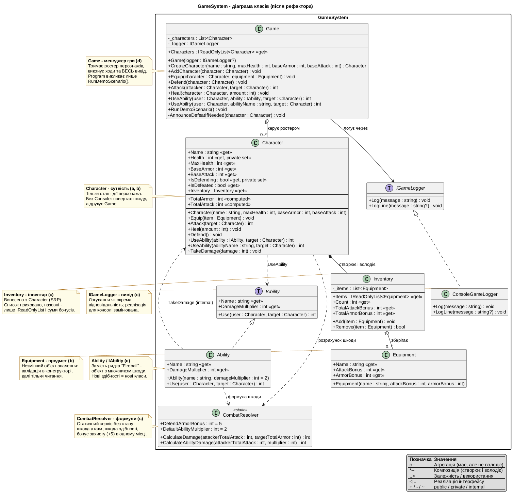

# GameSystem - рефакторинг ігрової підсистеми

Навчальний проєкт: ігрова бойова система на C# (.NET 8), розділена на модулі,
класи - за єдиною відповідальністю (SRP), стан захищено модифікаторами доступу.

## Структура

```
Assignment.slnx
src/GameSystem/      - бібліотека: Game, Character, Equipment, Inventory,
                       CombatResolver, IAbility/Ability, IGameLogger/ConsoleGameLogger
src/Assignment.App/  - консольний застосунок (точка входу через Game)
docs/                - діаграма класів (.puml + .png) і звіт (.docx)
```

## Як зібрати і запустити

Потрібен [.NET 8 SDK](https://dotnet.microsoft.com/download).

```bash
dotnet build
dotnet run --project src/Assignment.App
```

## Сумісність з версіями .NET

* Збірка: .NET 8 SDK або новіший (класичний `Assignment.sln` читають усі версії).
* Запуск: рантайм .NET 8, 9 або 10 - перевірено на 8.0.31, 9.0.20 і 10.0.12.
  Проєкт таргетує `net8.0`, а `RollForward LatestMajor` в `Assignment.App`
  дозволяє запуск на новіших рантаймах, коли 8.0 не встановлено.
* Рантайми старіші за 8.0 не підійдуть; без встановленого .NET потрібен .NET 8 SDK.

Очікуваний вивід:

```
========== GAME SYSTEM ==========

Merlin equipped Staff of Fire (+10 ATK, +0 ARM).
Arthur equipped Steel Shield (+0 ATK, +10 ARM).

Arthur braces for impact, increasing armor temporarily.
Merlin attacks Arthur for 15 damage!
Arthur attacks Merlin for 13 damage!
Merlin heals for 15 HP. Current HP: 70/70
Merlin uses special ability: [Fireball] on Arthur!
```

## Ключові рішення

* `Game` - менеджер гри: ростер персонажів, усі ходи, весь вивід, демо-сценарій.
* `Character` - тільки стан і дії, без `Console`; інвентар делегує `Inventory`,
  формули шкоди - `CombatResolver`, здібності - `IAbility`.
* `TakeDamage` - `internal`: доступний здібностям у межах збірки, закритий для зовнішнього коду.
* `Ability` - здібності як об'єкти замість рядків (Open/Closed: нові здібності = нові класи).

## Діаграма класів



Повний звіт з ролями класів: `docs/GameSystem_Report.docx`.
